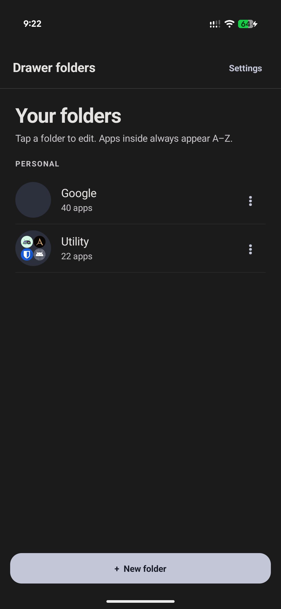
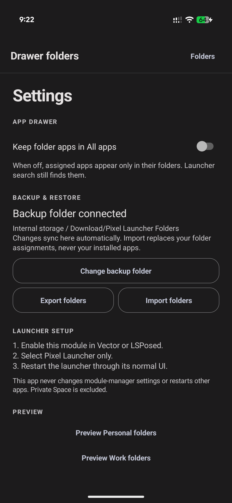
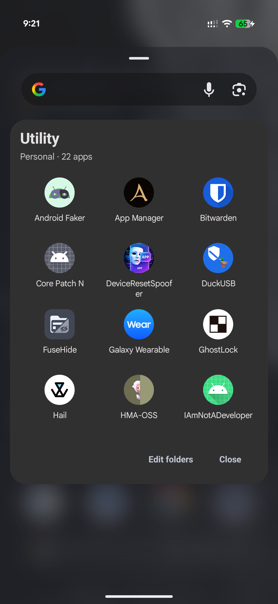
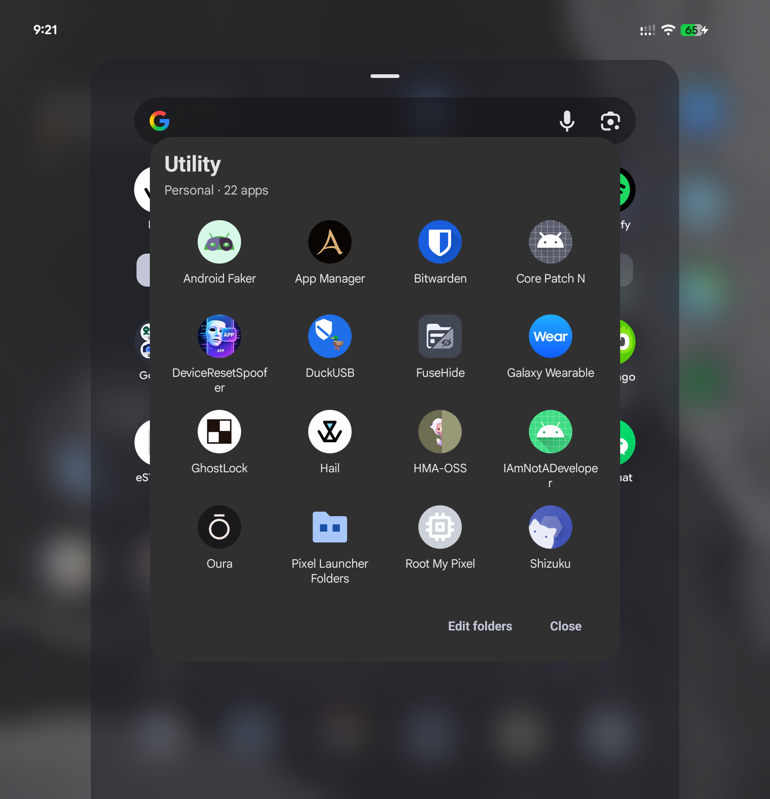

<div align="center">

# Pixel Launcher Folders

**Folders for the Pixel Launcher app drawer**

[](https://github.com/doccstat/pixel-launcher-folder/releases)
[](https://github.com/doccstat/pixel-launcher-folder/releases)
[](https://www.android.com/)
[](https://github.com/LSPosed/LSPosed)
[](https://github.com/doccstat/pixel-launcher-folder)

</div>

---

## What it does

Pixel Launcher Folders adds real folder cells to the beginning of the Pixel
Launcher app drawer. They look and behave like launcher cells, while the folder
contents remain managed by this module.

- Create and arrange folders directly in the Pixel Launcher app drawer.
- Preserve the exact Android profile identity for every folder.
- Sort folder apps and four-icon previews alphabetically by visible label.
- Open an app with a tap; long-press an app to start the launcher drag flow.
- Optionally hide folder apps from the main alphabetical app list.
- Back up folders to ordinary, user-visible Files storage as editable `.txt`
  files plus a metadata manifest.
- Restore assignments without installing, removing, or modifying applications.

The launcher database is never edited. Existing APKs are never changed.

## Screenshots

Captured on a Pixel 11 Pro Fold running Android 17 and Pixel Launcher 17.
The Google folder preview in the first image has been redacted for privacy.

<table>
<tr>
<td width="50%" valign="top">

### Drawer folders

<a href="docs/screenshots/drawer-folders.png"></a>

</td>
<td width="50%" valign="top">

### Settings

<a href="docs/screenshots/settings.png"></a>

</td>
</tr>
<tr>
<td width="50%" valign="top">

### Homescreen drawer

<a href="docs/screenshots/homescreen.png"></a>

</td>
<td width="50%" valign="top">

### Unfolded homescreen drawer

<a href="docs/screenshots/unfolded-homescreen.png"></a>

</td>
</tr>
</table>

## Requirements

- Android 15 or newer.
- A rooted device with LSPosed, Vector, or a compatible Xposed framework.
- Pixel Launcher with package name `com.google.android.apps.nexuslauncher`.
- A usable Android profile; managed profiles are supported when available.

### Compatibility warning

This is a **public-beta candidate**, not a universal Pixel Launcher extension.
The maintained integration target is:

| Device | Android | Pixel Launcher |
| --- | --- | --- |
| Pixel 11 Pro Fold | 17 | 17 / version code 907 |

Pixel Launcher internals can change independently of Android. If a launcher
update breaks the module, disable its scope in LSPosed/Vector; folder data is
kept by the settings app.

Private Space and unknown profile types are intentionally excluded.

## Installation

1. Download the latest release APK from [Releases](https://github.com/doccstat/pixel-launcher-folder/releases).
2. Install it on the rooted device.
3. Enable `Pixel Launcher Folders` in LSPosed/Vector.
4. Scope it to **Pixel Launcher only**:
   `com.google.android.apps.nexuslauncher`.
5. Restart Pixel Launcher through the normal launcher or system UI.
6. Open **Pixel Launcher Folders** and create your folders.

The module has no service, receiver, boot action, polling loop, or module-manager
mutation. It does not restart Pixel Launcher for you.

## Using folders

### Create and edit

Open the settings app and tap **New folder**. Choose a name, select the
profile when prompted, then choose the apps. A saved folder keeps its original
profile; create a new folder to choose another one.

Tap a folder in the drawer to open it. Long-pressing a folder opens the
settings app. Apps inside the folder are displayed alphabetically.

### Keep apps in All apps

The **Keep folder apps in All apps** setting controls whether assigned apps
remain in the normal alphabetical launcher list:

- **On:** apps appear in both the folder and the main app list/search.
- **Off:** apps are removed from that profile's main app list but remain
  available through the folder and launcher search.

Apps are evaluated independently in each Android profile.

### Backup and restore

Choose a folder through Android's document picker. Export creates:

```text
Google.txt
Utility.txt
.pixel-launcher-folders.json
```

Each text file contains one package identifier per line. The JSON manifest
preserves folder IDs, order, profile kinds, exact user serials, and the drawer
setting. Changes sync to the selected backup folder after saves;
the settings app reloads the backup when it opens.

Import accepts that manifest or a directory of plain `.txt` files. Without a
manifest, filenames become folder names in the default profile and lines may be package names
or flattened launcher components. Import replaces folder assignments only; it
never installs, removes, disables, or modifies apps. Folders whose profile is
unavailable are skipped rather than aborting the whole restore. Export before
clearing app data or migrating to an APK with a different signing certificate.

## Privacy and safety

- No internet permission is required.
- No app installation or uninstallation is performed.
- No launcher database writes are performed.
- No Private Space data is read or stored.
- Backup files are created only in the user-selected Files folder.
- The module is scoped to Pixel Launcher and does not hook other apps.

## Development

The direct SDK build runs on Windows with API 37 and build-tools 36.0.0:

```powershell
python build.py
python build.py --test
```

The current device instrumentation suite passes **79 checks**, including
profile isolation, exact serial matching, backup-state safety,
folder geometry, settings navigation, popup attachment in a launcher window
context, and preservation of real user preferences.

Development builds use a disposable signing key. Do not distribute them as
updates. Official releases are built and signed by the protected release
workflow.

## Support

Report problems in [Issues](https://github.com/doccstat/pixel-launcher-folder/issues)
with your device model, Android version, Pixel Launcher version/code, module
version, and reproduction steps. Mention the affected Android profile and
whether you used the outer or unfolded display. Redact sensitive information
from screenshots and logs.

App dragging uses the launcher/system activity-drag contract. Split-screen and
pop-up drop support depends on the launcher build and remains experimental.

This project is not affiliated with Google, Pixel Launcher, or LSPosed.
